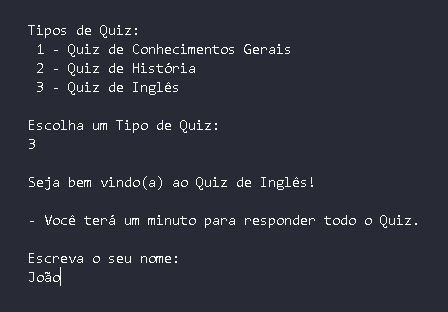
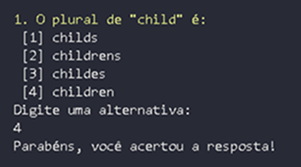
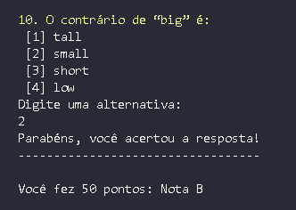
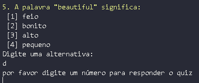

# 🎯 Quiz Temático em Go

Este é um projeto de **quiz interativo em linha de comando** desenvolvido em **Go**. O código base foi iniciado durante o curso introdutório de Go na [Rocketseat](https://www.rocketseat.com.br)
, e a partir dele implementei novas funcionalidades que tornaram o jogo mais completo e dinâmico.

---

## 🎮 Funcionalidades

- ⏱️ **Timer**: o usuário possui 60 segundos para responder todo o quiz; o jogo encerra automaticamente ao atingir o tempo limite.

- 📝 **Pontuação e nota final**: ao término do quiz, o jogador recebe sua nota e pontuação correspondentes.

- 🎯 **Seleção de tema**: é possível escolher entre três categorias de perguntas: conhecimentos gerais, história ou inglês.

- ✅ **Validação de entrada**: o sistema trata erros quando o usuário digita uma letra ou opção inválida, pedindo um número válido em vez de encerrar abruptamente.

---

## 🛠️ Tecnologias Utilizadas

- [Go](https://go.dev) como linguagem principal

- Leitura de arquivos **CSV** para carregar perguntas

- Execução em **linha de comando (CLI)**

---

## 💡 Aprendizados

Durante o desenvolvimento, aprimorei meu conhecimento em **structs** para definir o estado do jogo e armazenar as questões, além da **manipulação de ponteiros** para alterar o comportamento do quiz conforme as escolhas do usuário. Também explorei a **aplicação de funções** para modularizar o código e melhorar sua organização, tornando-o mais reutilizável e fácil de manter.
Outro ponto importante foi a **utilização de channels** para implementar o timer, garantindo que o jogo encerrasse após o limite estabelecido. Além disso, pratiquei a **leitura de arquivos CSV** para carregar perguntas dinamicamente, o que tornou o quiz mais flexível e expansível para novos temas e desafios.

---

## 🖼️ Demonstração

### Menu inicial



### Exemplo de perguntas



### Resultado final



### Validação de entrada do usuário



---

## ✅ Conclusão

Esse projeto foi essencial para consolidar conceitos fundamentais de Go, desde a estruturação com structs e ponteiros até o uso de channels e leitura de arquivos. Foi um desafio que me permitiu transformar a prática em um sistema funcional e divertido, fortalecendo minha lógica de programação e habilidades com a linguagem.

---

## ▶️ Como Executar o Projeto

1. Clone este repositório:
   ```bash
   git clone https://github.com/marcosviniciusribeiiro/quiz-go.git

2. Acesse a pasta do projeto:
   ```bash
   cd quiz-go

3. Execute o projeto com:
   ```bash
   go run main.go

## 📌 Autor

👤 Marcos Vinícius Ribeiro
- 📧 [LinkedIn](https://www.linkedin.com/in/marcos-vinícius-ribeiro-gonçalves-46a0b0351)
