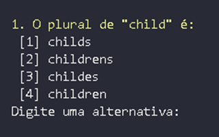

# Quiz de Perguntas e Respostas (Go)

Este é um projeto simples desenvolvido em **Go** que implementa um **quiz interativo no terminal**.  
O objetivo do projeto é praticar lógica de programação, uso de funções, loops, manipulação de entradas do usuário e controle de tempo.

---

## 💡 Aprendizados

Durante o desenvolvimento, aprimorei meu conhecimento em structs para definir o estado do jogo e armazenar as questões, além da manipulação de ponteiros para alterar o comportamento do quiz conforme as escolhas do usuário. Também explorei a aplicação de funções para modularizar o código e melhorar sua organização, tornando-o mais reutilizável e fácil de manter.

Outro ponto importante foi a utilização de channels para implementar o sistema de tempo (timer), garantindo que o jogo encerrasse após o limite estabelecido. Além disso, pratiquei a leitura de arquivos CSV para carregar perguntas dinamicamente, o que tornou o quiz mais flexível e expansível para novos temas e desafios.

---

## 🎮 Funcionalidades

- Exibição de menu inicial com opções para iniciar o quiz ou sair.
- Perguntas de múltipla escolha com alternativas numeradas.
- Contagem de pontos ao longo do jogo.
- Mensagem final exibindo o resultado e nota do jogador.
- **Validação de entrada**: se o usuário digitar algo inválido (ex: letra em vez de número), o programa solicita novamente sem quebrar.
- Controle de tempo para resposta: caso o tempo acabe, o jogo é finalizado.

---

## 🖼️ Demonstração

### Menu Inicial


### Exemplo de Perguntas


### Resultado Final


### Validação de Entrada
Mesmo que o usuário digite letras em vez de números, o programa não quebra.  
Ele solicita novamente uma resposta válida:


---

## 🚀 Tecnologias Utilizadas
- [Go](https://golang.org/) — linguagem principal.

---

## ▶️ Como Executar o Projeto

1. Clone este repositório:
   ```bash
   git clone https://github.com/marcosviniciusribeiiro/quiz-go.git

2. Acesse a pasta do projeto:
   ```bash
   cd quiz-go

3. Execute o projeto com:
   ```bash
   go run main.go

## 📌 Autor

👤 Marcos Vinícius Ribeiro
- 📧 [LinkedIn] (https://www.linkedin.com/in/marcos-vinícius-ribeiro-gonçalves-46a0b0351)

- 📂 [GitHub] (https://github.com/Marcosviniciusribeiiro)
